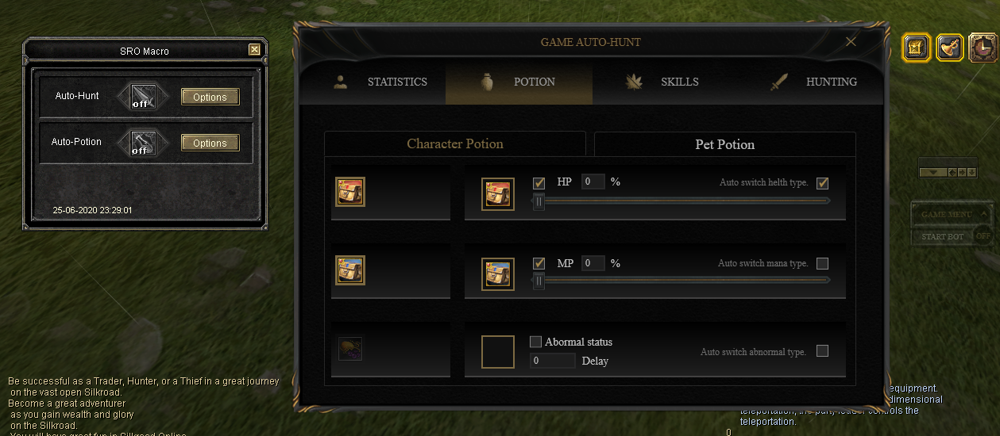
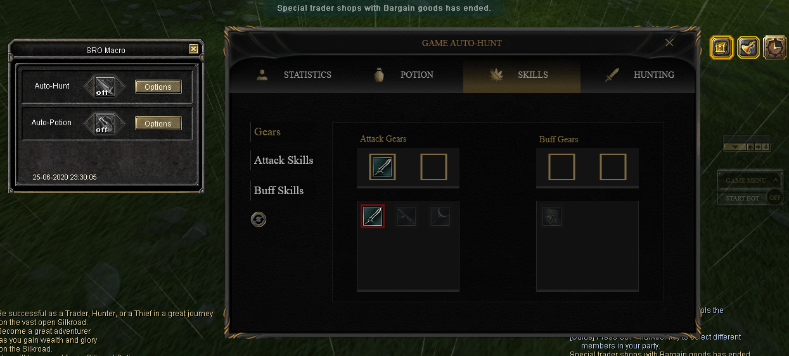
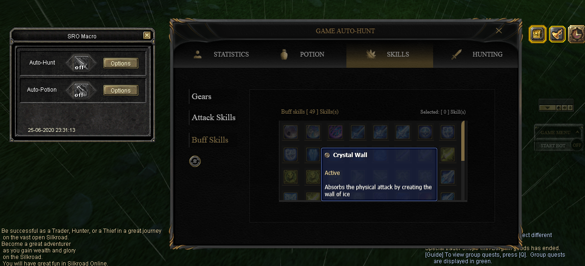
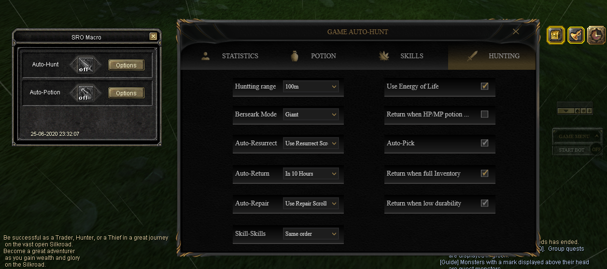

# Silkroad-bot

## Overview
Silkroad-bot is an in-game bot for Silkroad Online. It is developed using C# and WPF.

## Features
- Automatic farming
- Auto-potion
- Skill casting
- Inventory management

## Installation
1. Clone this repository.
2. Open the project in your favorite C# IDE (e.g., Visual Studio).
3. Build and run the project.

## Usage

After launching the bot, enter your Silkroad Online credentials and select your desired functionalities.

## License

This project is licensed under the MIT License.
